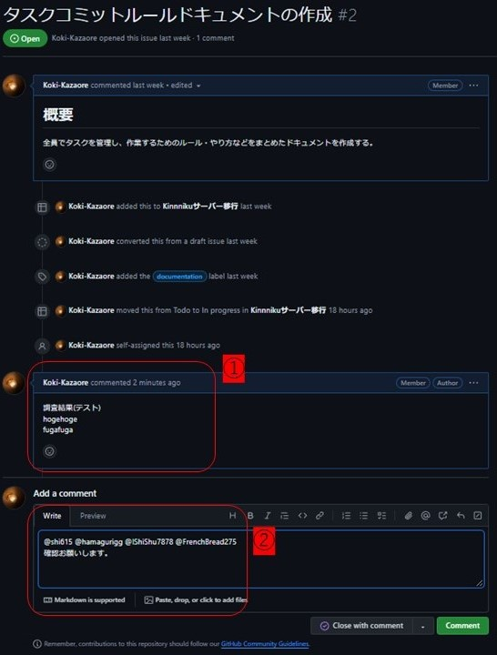
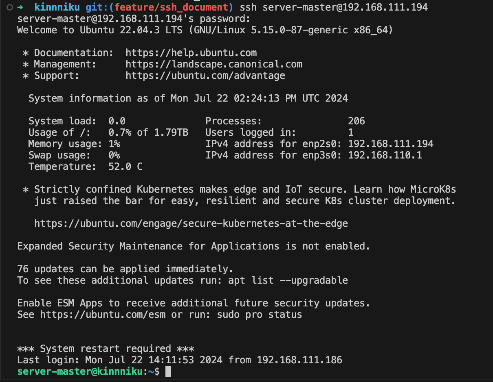

# kinnniku
知能モデリング研究室(小高研)ネットワークサーバー管理レポジトリ

## 本レポジトリの意義・目的
- 研究活動のインフラとなるネットワークを学生自身で構築・運用しネットワークに対しての理解を深める．
- GitHub Issues や Projects を利用してタスク管理を効率化・可視化する．
- ネットワークサーバーをスクラッチ開発しているドキュメント自体が少ないため，この活動自体をコンテンツとして提供する．

## タスク管理手順
基本方針としては，[【初学者向け】GitHub Projectsでのタスク管理のススメ #todo - Qiita](https://qiita.com/haganenoubik/items/55700919e2e5b127e166#%E4%BD%BF%E3%81%84%E6%96%B9)の`使い方`に沿って進めることとする．<br>
ただし，追加事項として，Issueをクローズする前に以下の手順を追加する．
1. Issueに対しての調査結果・取り組んだことを第三者が読んでもわかりやすいようにまとめる．
2. 自分以外の4人にメンションして確認依頼する．
3. メンションされたメンバーは内容を確認し，問題なければコメントにスタンプを付ける．意義があればディスカッションする．
4. 全員からスタンプを押されたらIssueをクローズする．



## SSH接続方法
1. ターミナルから下記のコマンドを実行する
    ```bash
    ssh server-master@192.168.111.194
    ```
2. パスワードを入力する
    パスワードが要求されるので、それを入力する。パスワードは筋肉サーバーのNotionホームページにある.

SSH接続が成功すると以下のような画面が出る↓



## その他
- レポジトリを公開しているため，パスワードなどの機密情報の扱いには厳重に注意する．